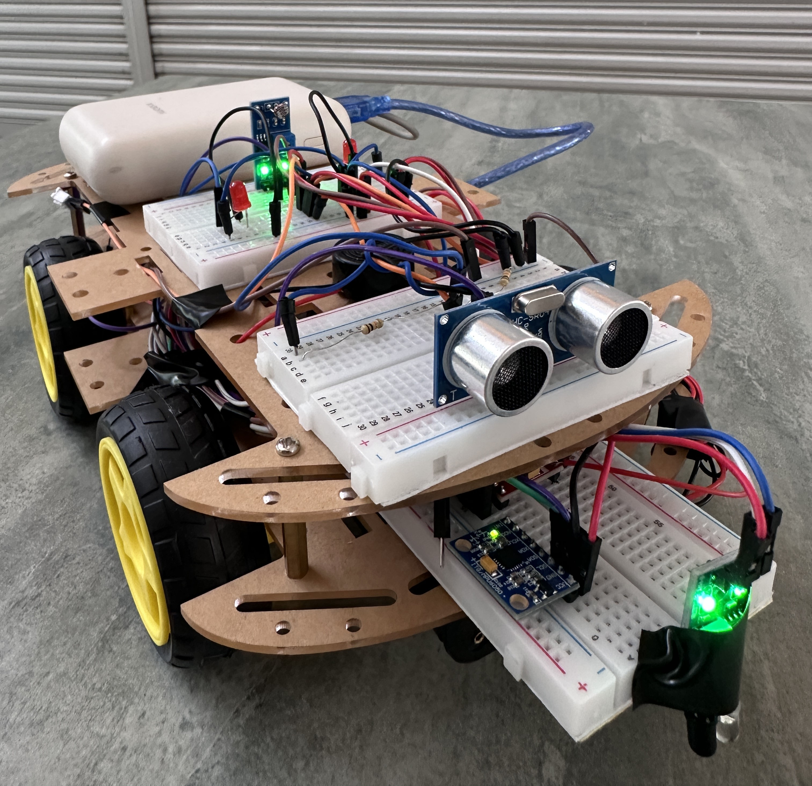
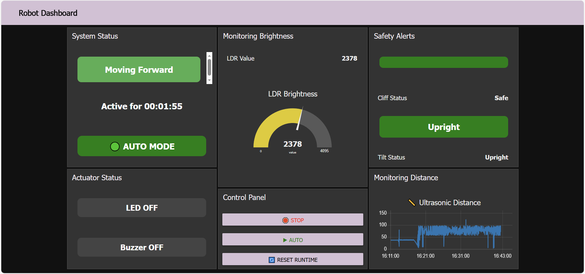

# IoT Smart Vacuum Robot

An IoT-based smart vacuum robot project developed using ESP32, sensors, and Node-RED for remote monitoring and automation.

## Features

* Obstacle detection using sensors
* Real-time monitoring through Node-RED dashboard
* Remote control and automation
* ESP32-based hardware integration

## Technologies Used

* ESP32
* Arduino IDE
* Node-RED
* IoT Sensors

## Project Preview
### Robot Prototype

### Node-RED Dashboard

## Project Structure

arduino/
* smart_vacuum_robot.ino

node-red/
* flows.json

images/
* robot.jpg
* dashboard.png
